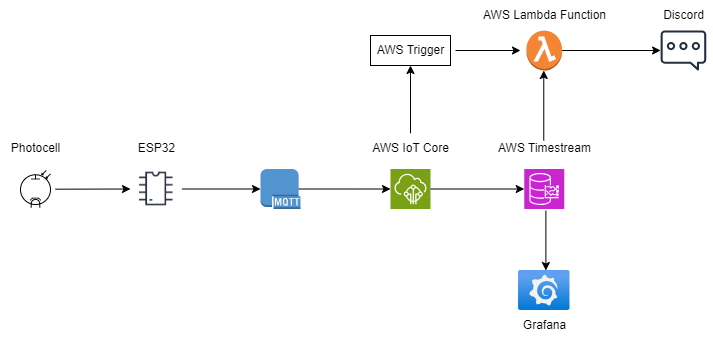
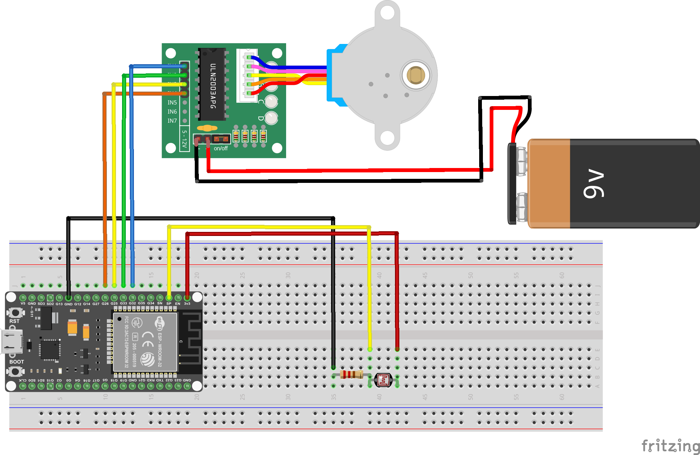
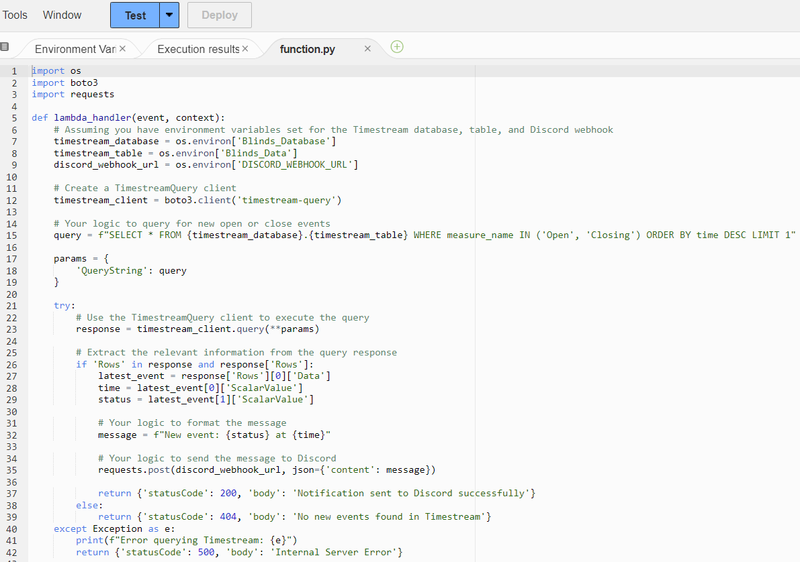
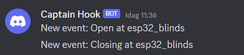
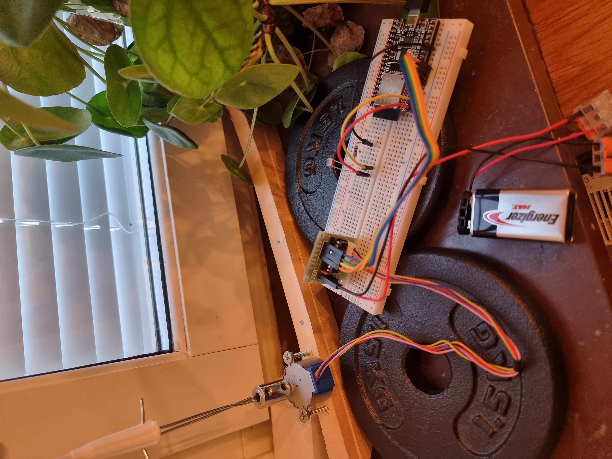

# IoT Blinds Controller using AWS

Author: Fredrik Jonsson

## Project Description

In this IoT project, an ESP32 microcontroller is employed to regulate blinds based on light conditions. The ESP32 connects via MQTT to AWS for data storage, with Timestream managing data and Grafana offering a graphical representation of the blinds' states. Additionally, a Lambda function in AWS sends notifications about state changes to Discord via a webhook.

## Objective

I get blinded when i step into my kitchen every morning since it is directly in the path of the sun at that time. I want to remedy this and that's why the goal is to create a smart blinds control system that adapts to changing light conditions. Below is a tutorial on how to get started leveraging AWS for secure communication, data storage, and Grafana for visual insights, the system also ensures real-time notifications through Discord. The project aims to provide a seamless and intelligent solution for managing my blinds at home.

## System Components

- **Microcontroller:** ESP32
- **Electrical Components:**
    - 10k ohm resistor
    - Connecting wires
    - 9v Battery
- **Sensors:** Photocell
- **Actuators:** 
    - Stepper motor for blinds
    - Driver for stepper motor
- **AWS Components:**
  - IAM Role for Timestream and Lambda function
  - IoT Core
  - Amazon Timestream
- **Visualization:** Grafana
- **Notification:** AWS Lambda function for Discord

## System Architecture

ESP32 utilizes the MQTT protocol to communicate with AWS IoT Core for data storage in Timestream. Grafana retrieves and visualizes data, providing insights. Discord notifications are facilitated by an AWS Lambda function which is triggered when IoT Core receives new data about change of state.

## Connections

All the connections are shown in the image below:

## Key Configurations

## AWS IoT Core

### Create Thing in IoT Core:

1. **Create Thing:**
   - Add a new thing in the AWS IoT Core console.

2. **Create and Attach Policy:**
   - Create a policy for your thing in the AWS IoT Core console.
   - Attach the policy to your thing.

3. **Create Certificates:**
   - Generate certificates that will be incorporated into your "secrets.h" header.

## Timestream Setup

### Create Timestream Database and Table:

1. **Access Amazon Timestream Console:**
   - Navigate to the Amazon Timestream console and click "Get Started."

2. **Create Database and Table:**
   - Create a new database and table for blinds control data.

### Discord Notifications in AWS Lambda

1. **Create a new channel in Discord** 

   - Via integrations in the settings menu, select "create Webhook". Use the generated link in the python code for notifications in your Lambda function.

1. **In AWS Create Lambda Function:**
   - AWS Lambda console > Create function > Configure.

2. **Add Python code for Discord notifications.**

    

3. **Configure Lambda Triggers:**
   - In Lambda console, go to Configuration > Triggers
   - Add a trigger, e.g., IoT Core, to invoke Lambda when blinds state changes.

4. **Test Lambda Function:**
   - Manually trigger the Lambda function.
   - Check Discord and logs in AWS for execution results.
   - Discord should look something like this if it is successful:

    

## AWS IAM Role

### Create IAM Role for Timestream and Lambda:

1. **Access IAM Dashboard:**
   - Go to the IAM dashboard in the AWS Management Console.

2. **Create Role:**
   - Click on "Roles" and create a new role for Timestream and one for Lambda.

3. **Attach Policies:**
   - Attach policies granting necessary permissions for the Timestream and Lambda roles. E.g. the Lambda role should contain permission to get full access to Timestream.

### Grafana Setup

1. **Set up a Grafana account**
   - Set up your account
   - In Grafana, install the AWS Timestream plugin

2. **Add Timestream as Data Source:**
   - In Grafana, go to "Settings" > "Data Sources."
   - Click "Add" and choose "Amazon Timestream."
   - Configure Timestream endpoint, region, and credentials.

3. **Create Dashboards and Panels:**
   - Create a new dashboard in Grafana.
   - Add panels linked to Timestream queries for blinds control data.
   - Customize panels to display relevant information.

    When this is set up data should be accessible in grafana. Using an SQL Query such as "SELECT 'column_name' FROM $__database.$__table ORDER BY time DESC LIMIT 1" a "State" type visualization can be implemented:

# Security Considerations

## Benefits

### AWS IoT Core

1. **Secure Device Communication:**
   - AWS IoT Core provides secure communication between devices and the cloud using MQTT.
   
2. **Identity and Access Management:**
   - IAM roles and policies ensure secure access to AWS resources, limiting potential vulnerabilities.

3. **Certificate-Based Authentication:**
   - Device authentication is enhanced through the use of certificates, adding an extra layer of security.

### Timestream and Grafana

1. **Encrypted Data Transmission:**
   - Data transmission to Timestream is encrypted, ensuring the confidentiality of the blinds control data.

2. **Access Control in Grafana:**
   - Grafana allows for access control, restricting user privileges and enhancing data security.

### Discord Notifications

1. **Webhook Security:**
   - Discord webhooks provide a secure way to send notifications without exposing sensitive information.

2. **AWS Lambda Security:**
   - Lambda function execution is governed by IAM roles, enhancing overall security.

## Downsides

### Device Security

1. **Potential Device Exploitation:**
   - As with any IoT device, the ESP32 may be susceptible to exploitation if not properly secured.

2. **Limited Processing Power:**
   - IoT devices often have limited processing power, making complex security measures challenging to implement.

### Cloud Service Dependencies

1. **Dependency on AWS Security:**
   - The security of the setup relies heavily on AWS's infrastructure, making it crucial to monitor AWS security updates.

2. **Grafana User Authentication:**
   - Grafana user authentication must be carefully configured to prevent unauthorized access.

### Discord Integration

1. **Webhook Vulnerabilities:**
   - Inadequate protection of Discord webhooks could lead to unauthorized access or abuse.

2. **Lambda Function Security:**
   - Misconfigured Lambda functions may pose security risks; regular audits and updates are essential.

## Project Demonstration

This is what it looks like when everything is mounted. Perhaps not the most eye catching setup but more than good enough for this POC project:

Follow this link for a short video demonstration:
https://youtube.com/shorts/91DA4M26aF4?si=OqnUGSN8jAu8478g

## Conclusion

This IoT project successfully integrates an ESP32 microcontroller, AWS services, Grafana, and Discord for an intelligent blinds control system. The secure communication, data storage, detailed visualization, and real-time notifications enhance the user experience and provide valuable insights into the blinds' behavior. The modular architecture allows for easy expansion and customization based on specific requirements.
